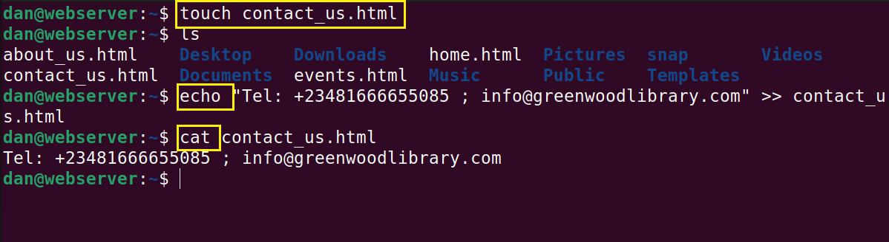
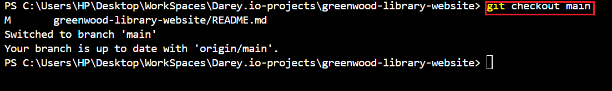
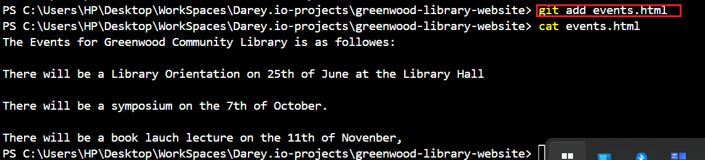

# Git Project Implementation

In this project, i am tasked with enhancing the website of "Greenwood Library Community". I wil be adding a "Book Reviews" section and also updating the "Event" page. 

To achieve this, I will be implementing some basic linux commands, cloning repository, staging, commiting and pushing changes. Also, I will be doing some pull request and merge. 

I will be simulating the roles of two contributors: "Morgan" who is focused on adding the Book Review and "Jamie" who is update the Event page.

I created files for the webpages for Greenwood Library website and included random content.

* home
* about_us
* events
* contact_us

These html files were created using `touch` command.

Content was added into each file using `echo` command with `>>`

Files are ready to be staged. Here we use command `git add .` 

I made sure i was under the main branch

## Staging

To stage my files and get them ready for commit, i used command `git add .`

This adds all the files to be committed.

## Git Commit

I committed the files by using commmand `git commit -m` 

This takes the staged changes and records them in the repository's history with a message describing what was done. 

## Git push

After files had been commmitted, they were pushed to the remote repository using the command `git push`

## Morgan's Work: Adding Book Reviews

To begin, i made sure i am in the folder containing the cloned Github repository on my local machine.

I execute git branch to check my current branch.

Then i created a new branch for Morgan named "add-book-reviews". 
I did this by running commmand `git checkout -b add-book-reviews`

This command automatically switches to the newly created branch from the main branch.

I created to file name book_reviews.html using the `touch` command

I staged Morgan's work by running `git add book_reviews.html`

Git commit was done by runnning `git commmit -m book_reviews.html`
The `-m` in the command means message describing what was done.git com

Morgan's Work was pushed to the remote repository by running the command `git push origin add-book-reviews`

After a successful push, i did a pull request.

## Pull Request and Merge

A PuLL Request is a feature used in Github that allows you to notify team members about the changes you have pushed to a branch in a repository. 

A Merge of Pull Request is to merge all commits from the feature branch to the main branch in a merge commit. 

I did a successful Pull Request and Merge. 

## Jamie's Work: Update Event Page

Step 1: I switched back to main branch.
i did this by running the code `git checkout main`

Step 2: I did a git pull of Morgan's work to pull the latest changes.

Step 3: Created new branch for Jamie's work

Step 4: Event page was update with additional text and staged with `git add` 

Step 5: Git commit was done

Step 5: Jamie's work was pushed to remote repo by doing git push

Step 6: Pull Request and Merge was done on Jamie's work

